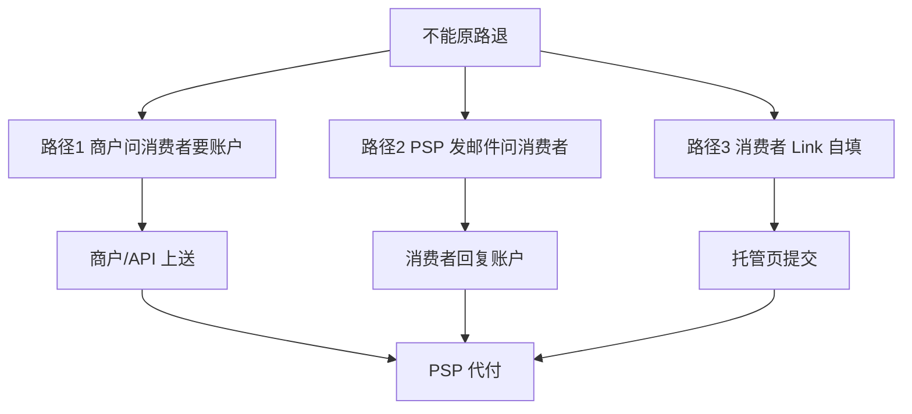
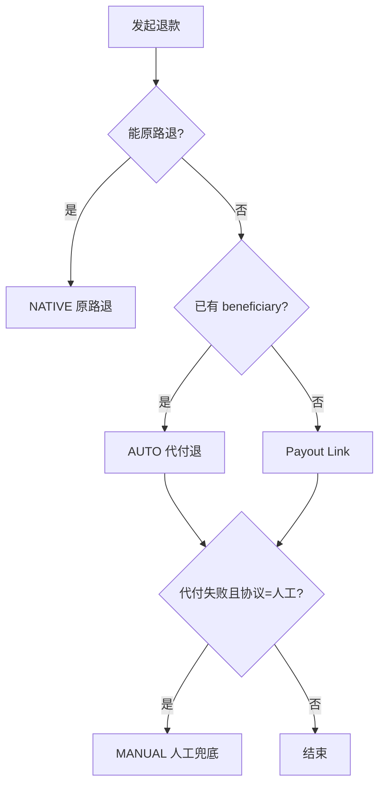

# 无原路退能力时，竞品怎么做？

> 调研摘要 · 适用于产品/研发评审

---

## 1. 背景与结论

**调研问题**  
QRIS、PromptPay、PayNow 等支付方式**不能原路撤销**时，各 PSP 如何处理退款？

**核心结论**  
本质相同：**先拿到消费者的退款收款信息**（银行/钱包账号、姓名、手机等），再 **代付打款**。  
差异仅在两点：**谁去向消费者收集信息**、对外 API/产品叫什么名字。

**相关文档**  
[`PAYLOCO-PAYOUT.md`](./PAYLOCO-PAYOUT.md) · [`DRAGONPAY-REFUND.md`](./DRAGONPAY-REFUND.md)

---

## 2. 三种路径（统一模型）

| 路径 | 谁收集退款信息 | 代表竞品 |
|:----:|----------------|----------|
| **1 商户代收集** | 商户/客服问消费者，再通过 API 上送 | PingPong、连连、DragonPay、Airwallex、2C2P |
| **2 PSP 邮件收集** | PSP 发邮件向消费者要账户（商户不亲手问） | Stripe、dLocal |
| **3 Link 自填** | 消费者在 PSP/商户托管页填写 | Xendit、PayKKa |

**说明**：路径 1 与路径 2 本质相同，信息都来自消费者；路径 2 只是把「问账户」外包给 PSP 邮件。

---

## 3. 竞品总览（一张表看完）

| 平台 | 路径 | 无原路退时怎么做 | 商户要做什么 |
|------|:----:|------------------|------------|
| **PingPong** | 1 | Refund API + 特殊参数（PromptPay/VNM QR 等） | 向客户咨询后，提供账号/手机/银行/姓名 |
| **连连** | 1 | 「付款退回」或 Refund API + `card` | 提供退款账户、退款证明 |
| **DragonPay** | 1 | 渠道 Payout API（非 Refund） | 必传姓名、邮箱、手机 |
| **Airwallex** | 1 | PromptPay **不可 Refund**，另走 **Transfers** | 收集 `account_name` / `account_number` 等 |
| **2C2P** | 1 | Refund + 银行账户字段 / `refundToBankAccount` | 部分场景提供收款账户 |
| **Stripe** | 2 | Refund 状态 `requires_action`，Stripe 自动邮件要账户 | 下单时留邮箱；可传 `instructions_email` |
| **dLocal** | 2 | Refund；缺参时 dLocal 邮件问买家 | 尽量带全 beneficiary；否则等买家回复邮件 |
| **Xendit** | 3（或 1） | Payout Links 或 Create Payout | Link：发链；Payout：商户传账户 |
| **Payloco** | 1 / 3 | `/api/payout/create` 代付 | AUTO 传 beneficiary，或走 Link |
| **PayKKa** | 1 / 3 | 代付退产品 | AUTO 或 Payout Link；另有人工兜底 |

---

## 4. 路径 1 — 商户向消费者拿信息

| 平台 | 对外说法 | 商户要做什么 | 官方文档 |
|------|----------|--------------|----------|
| PingPong | Refund + 特殊参数 | 提供退款账户、退款信息 | [特殊支付方式退款说明](https://acquirer-api-docs-v4.pingpongx.com/notes/zh/guide/bestPractices/specialRefund/) |
| 连连 | 付款退回 / Refund + `card` | 提供退款账户、退款证明 | [退款方式](https://global.lianlianpay.com/support/detail/744W1OkI) · [退款 API](https://doc.lianlianpay.com/apidoc/project-345279/3476475e0) |
| DragonPay | 渠道 Payout | 提供姓名、邮箱、手机（作钱包账号） | [MassPayout PDF](https://www.dragonpay.ph/wp-content/uploads/2022/04/Dragonpay-API-MassPayout.pdf) |
| Airwallex | Transfers（与 Refund 分开） | 提供泰国银行账户等信息 | [PromptPay](https://www.airwallex.com/docs/payments/payment-methods/apac/promptpay) · [泰国出款](https://www.airwallex.com/docs/payouts/payout-network/bank-accounts/thailand) |
| 2C2P | Refund + 账户字段 | 提供 `accountName` / `accountNumber` 等 | [Payment Process](https://developer.2c2p.com/docs/api-payment-action-payment-process) · [/refund](https://devzone.2c2p.com/reference/refund) |
| PayKKa AUTO | 代付退 | MPS/API 上送 `beneficiary` | 内部需求 |

**PingPong**（PromptPay 示例）

- 必填：`channelCode`、`customer.name`；手机 / 证件号 / 银行账号三选一
- 官方原文：「商户需要向客户咨询后提供此信息」
- 无 Payout Link

**连连**

| 方式 | 含义 |
|------|------|
| 原路退回 | 按原支付链路退回（渠道支持时） |
| 付款退回 | 以连连国际名义付到原打款人账户；**渠道不支持原路退**时使用 |

- 不支持原路退时：需提供退款账户、退款证明（[来源](https://global.lianlianpay.com/support/detail/i91OxNMq)）
- API：`card` 字段用于「无法原路退回银行卡等情况」

**Airwallex**

- [PromptPay](https://www.airwallex.com/docs/payments/payment-methods/apac/promptpay) 能力表：**Refunds ✗**、Partial Refunds ✗
- [Refunds 文档](https://www.airwallex.com/docs/payments/payment-operations/manage-payments/refunds)：要打至不同账户须用 **separate transfer outside the refund flow**
- 实操：商户收集账户 → 调 **Transfers/Payout**（非 Refund API）

**DragonPay** · **2C2P**

- DragonPay：REST 收单无 refund 端点，退款走 Payout（详见 `DRAGONPAY-REFUND.md`）
- 2C2P：部分 QR 可走原路 [QR MPM Refund](https://developer.2c2p.com/docs/snap-qr-codes-refund)；否则退款请求带银行账户

**横向对比**

| 对比项 | PingPong | 连连 | Airwallex | PayKKa AUTO |
|--------|:--------:|:----:|:---------:|:-----------:|
| 谁问消费者 | 商户 | 商户 | 商户 | 商户 |
| 无原路退入口 | Refund+特殊字段 | 付款退回 | Transfer（另 API） | Payloco payout |
| 消费者 Link 自填 | 否 | 否 | 否 | 否 |

---

## 5. 路径 2 — PSP 发邮件向消费者要账户

| 平台 | 做法 | 官方文档 |
|------|------|----------|
| Stripe | PromptPay 等无原生退：Refund 进入 `requires_action`，Stripe **自动邮件**消费者要银行账号 | [PromptPay](https://docs.stripe.com/payments/promptpay) · [Refunds](https://docs.stripe.com/refunds) |
| dLocal | ALT 支付退款：缺 `beneficiary_name` / `bank` / `bank_account` 时，**dLocal 发邮件给买家** | [Refunds](https://docs.dlocal.com/docs/refunds) |

**Stripe 原文摘录**

> To complete a refund, your customer must tell us where to return the funds. Stripe automatically contacts the customer……and requests refund account information.

**dLocal 原文摘录**

> For alternative payment methods, a bank transfer will be made to the customer.  
> If parameters are missing, dLocal will send an email to the buyer asking them for beneficiary information.

---

## 6. 路径 3 — 消费者 Link 自填

| 平台 | 做法 | 官方文档 |
|------|------|----------|
| Xendit | Payout Links：邮件发链，消费者在托管页填账户 | [Payout Links](https://www.xendit.co/en/products/xenpayout/) |
| PayKKa | `/payout/[token]`：短信 / 邮件 / 商户转发链接 | 内部 Mock |

PingPong、连连、Airwallex **均无** Link；Stripe / dLocal 仅有邮件，无完整托管页。

---

## 7. 其他平台（简表）

| 平台 | 无原路退时 | 路径 |
|------|------------|:----:|
| Payloco（我方通道） | `/api/payout/create` 代付 | 1 或 3 |
| Antom | 多数原路 [Refund API](https://docs.antom.com/ac/ams/refund_online)；超窗/失败走 Dashboard 人工 | 原路为主 |
| Xendit | Create Payout（1）或 Payout Link（3） | 1 / 3 |

---

## 8. PayKKa 相对竞品

| 能力 | PingPong / 连连 / Airwallex | Stripe / dLocal | PayKKa |
|------|:---------------------------:|:---------------:|:------:|
| 商户代收集 + 代付（路径 1） | 支持 | — | **AUTO** |
| PSP 代发邮件收集（路径 2） | 不支持 | 支持 | 可用短信/邮件发 Link |
| Link 自填（路径 3） | 不支持 | 不支持 | **支持** |
| OPS 审核 + 人工兜底 | — | — | **支持** |

**路由（一期）**

---

## 9. 官方文档速查

| 平台 | 文档链接 |
|------|----------|
| PingPong | https://acquirer-api-docs-v4.pingpongx.com/notes/zh/guide/bestPractices/specialRefund/ |
| 连连 | https://global.lianlianpay.com/support/detail/744W1OkI |
| 连连 API | https://doc.lianlianpay.com/apidoc/project-345279/3476475e0 |
| Airwallex PromptPay | https://www.airwallex.com/docs/payments/payment-methods/apac/promptpay |
| Airwallex Refunds | https://www.airwallex.com/docs/payments/payment-operations/manage-payments/refunds |
| Airwallex 泰国出款 | https://www.airwallex.com/docs/payouts/payout-network/bank-accounts/thailand |
| Stripe PromptPay | https://docs.stripe.com/payments/promptpay |
| Stripe Refunds | https://docs.stripe.com/refunds |
| dLocal Refunds | https://docs.dlocal.com/docs/refunds |
| 2C2P QR Refund | https://developer.2c2p.com/docs/snap-qr-codes-refund |
| 2C2P /refund | https://devzone.2c2p.com/reference/refund |
| Xendit Payout Links | https://www.xendit.co/en/products/xenpayout/ |
| Payloco 接口列表 | https://docs.payloco.com/guide/ConfigSettings |
| DragonPay Payout | https://www.dragonpay.ph/wp-content/uploads/2022/04/Dragonpay-API-MassPayout.pdf |

---

## 10. 评审用一句话

不能原路退时，行业共性是 **先拿到消费者退款账户信息再代付**：PingPong / 连连 / DragonPay / Airwallex 靠**商户问清楚**（路径 1）；Stripe / dLocal 靠 **PSP 发邮件问**（路径 2）；Xendit 靠 **Link 自填**（路径 3）。PayKKa 覆盖路径 1 + 3，并增加 OPS 审核与人工兜底。

---

## 修订记录

| 日期 | 说明 |
|------|------|
| 2026-07-09 | 初版；明确「商户代收集」为行业共性 |
| 2026-07-09 | 增补 Airwallex、Stripe、dLocal、2C2P |
| 2026-07-09 | 重排版；路径统一为 1 / 2 / 3 |
