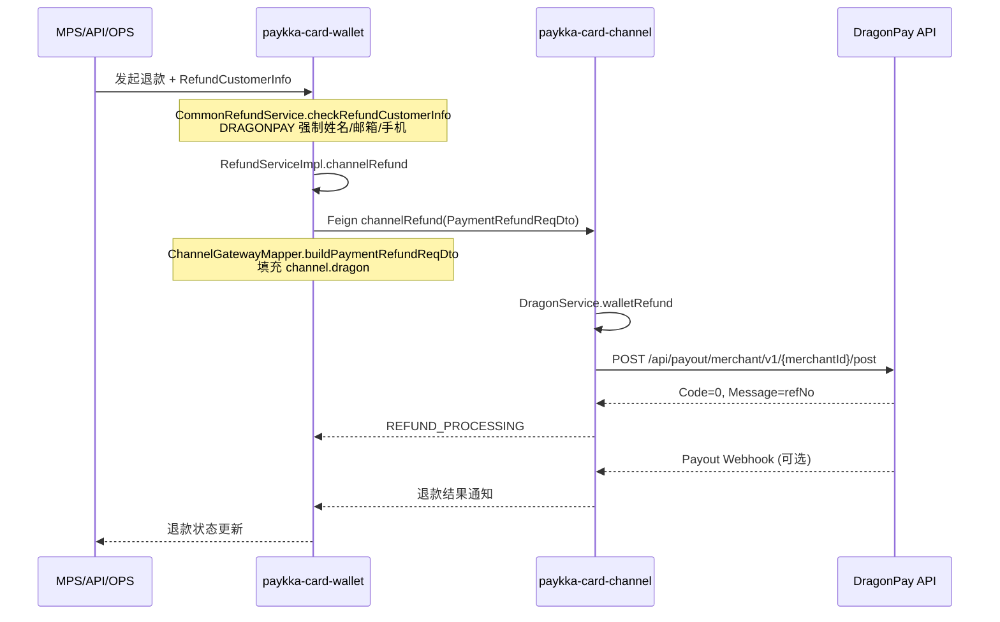

# DragonPay 退款对接说明

**适用场景**：菲律宾 DragonPay 钱包支付（GCash / PayMaya / GrabPay / ShopeePay 等）的**退款**

**与 Payloco 代付退款产品的关系**：DragonPay **不走** PayKKa「代付退款」产品（`supportsPayoutRefund`、Payout Link、OPS 人工/自动路由）。但 DragonPay 渠道侧**不支持传统原路撤销**，退款在渠道层实际调用的是 **DragonPay Merchant Payout API**（向消费者钱包打款），属于**渠道内置代付退**，不是 Payloco `/api/payout/create`。

---

## 1. 结论速览

| 维度 | DragonPay 退款 | PayKKa 代付退款产品（Payloco） |
|------|----------------|-------------------------------|
| 是否 `supportsPayoutRefund` | ❌ 否 | ✅ 是（Payloco + QRIS/PromptPay 等） |
| 退款入口 | 标准退款流程 `channelRefund` | 代付退分支 + beneficiary 信息 |
| 渠道 API | DragonPay `POST /api/payout/merchant/v1/{merchantId}/post` | Payloco `POST /api/payout/create` |
| 消费者信息 | 退款时**必填**姓名/邮箱/手机 | Payout Link 或 API 上送 beneficiary |
| OPS 人工代付 | ❌ 不涉及 | ✅ MANUAL_MERCHANT / MANUAL_CHANNEL |
| 鉴权 | Bearer `payoutSecretKey` | Payloco JWT + RSA 签名 |

---

## 2. 官方文档

| 文档 | 说明 |
|------|------|
| DragonPay 官网 | https://www.dragonpay.ph/ |
| Merchant API（Collect / Payout） | 向 DragonPay 索取 **Merchant Payout API** 文档（代码注释引用 Appendix 3/4/5） |
| 测试环境 Base URL | `https://test.dragonpay.ph`（见 `application-local.properties`） |

> PayKKa 代码中 Collect（收单）与 Payout（退款/出款）为两套鉴权：`secretKey`（Basic）vs `payoutSecretKey`（Bearer）。

---

## 3. 退款 API 一览（代码实现）

来源：`paykka-card-channel` · `DragonApiEnum` / `DragonRemoteClient`

| 能力 | 方法 & 路径 | 鉴权 | 说明 |
|------|-------------|------|------|
| **发起退款（Payout）** | `POST /api/payout/merchant/v1/{merchantId}/post` | Bearer `payoutSecretKey` | 代码方法名 `refund()`，实为创建 Payout |
| **退款查询** | `GET /api/payout/merchant/v1/{merchantId}/{txnId}` | Bearer `payoutSecretKey` | `refundQuery()` |
| **异步通知** | URL 回调（query string） | SHA-1 `digest` 验签 | 含 `merchantTxnId` 时按 **Payout/退款** 处理 |

对比收单 API（不走退款）：

| 能力 | 路径 | 鉴权 |
|------|------|------|
| 支付 | `POST /api/collect/v2/{txnId}/post` | Basic `merchantId:secretKey` |
| 支付查询 | `GET /api/collect/v2/txnid/{txnId}` 或 `/refno/{refNo}` | Basic |
| 撤销 | `GET /api/collect/v2/void/{txnId}` | Basic |

---

## 4. 发起退款请求字段

来源：`DragonRefundReqDto` · `DragonService.walletRefund()`

| JSON 字段 | 必填 | PayKKa 映射 | 说明 |
|-----------|------|-------------|------|
| `TxnId` | ✅ | `channelRefundOrderId` | 商户侧退款单号（幂等） |
| `FirstName` | ✅ | `RefundCustomerInfo.firstName` | 收款人名 |
| `MiddleName` |  | `RefundCustomerInfo.middleName` | 中间名 |
| `LastName` | ✅ | `RefundCustomerInfo.lastName` | 收款人姓 |
| `Amount` | ✅ | 退款金额 | |
| `Currency` | ✅ | 订单币种 | 目前仅 PHP |
| `Description` | ✅ | `{merchantName} Refund` | |
| `ProcId` | ✅ | 原支付方式 → `DragonPayoutChannelCodeEnum` | 见 §4.1 |
| `ProcDetail` | ✅ | `RefundCustomerInfo.phoneNumber` | **钱包账号/手机号** |
| `RunDate` | ✅ | 当天 `yyyy-MM-dd` | 执行日期 |
| `Email` | ✅ | `RefundCustomerInfo.email` | |
| `MobileNo` | ✅ | `RefundCustomerInfo.phoneNumber` | |

### 4.1 ProcId 与支付方式映射

| PayKKa 支付方式 | Dragon `ProcId` |
|-----------------|-----------------|
| G_CASH | `GCSH` |
| PAYMAYA | `PYMY` |
| GRABPAY | `GRPY` |
| SHOPEE_PAY | `SPAY` |

测试环境：`infrastructure.dragon.config.env.test.enable=true` 时统一使用 `BOG`。

### 4.2 请求示例

```json
{
  "TxnId": "CR211005336771096419",
  "FirstName": "Juan",
  "MiddleName": "",
  "LastName": "Dela Cruz",
  "Amount": 100.00,
  "Currency": "PHP",
  "Description": "Merchant ABC Refund",
  "ProcId": "GCSH",
  "ProcDetail": "09171234567",
  "RunDate": "2026-07-09",
  "Email": "juan@example.com",
  "MobileNo": "09171234567"
}
```

---

## 5. 响应 & 状态码

### 5.1 同步响应 `DragonRefundRespDto`

| 字段 | 说明 |
|------|------|
| `Code` | `0` = 受理成功（进入处理中），非 0 见 `DragonPayoutCodeEnum` |
| `Message` | 成功时为 **Payout Reference No**；失败为错误信息 |

常见 `Code`（`DragonPayoutCodeEnum`）：

| Code | 含义 |
|------|------|
| `0` | 受理成功 → `REFUND_PROCESSING` |
| `-4` | 无法创建 payout |
| `-5` | 无效收款账户 |
| `-8` | TxnId 重复 |
| `-12` | API Key 无效 |

### 5.2 查询状态 `DragonPayoutStatusEnum`

| status | 含义 | PayKKa 映射 |
|--------|------|-------------|
| `S` | 成功 | `REFUND_SUCCESS` |
| `F` | 失败 | `REFUND_FAILED` |
| `P` | 待处理 | `REFUND_PROCESSING` |
| `H` | On Hold | `REFUND_PROCESSING` |
| `G` | 处理中 | `REFUND_PROCESSING` |
| `V` | 撤销 | `REFUND_FAILED` |

### 5.3 异步回调 `DragonPayoutNotifyDto`

| 字段 | 说明 |
|------|------|
| `merchantTxnId` | 对应 `TxnId` / 渠道退款单号 |
| `refNo` | DragonPay 侧参考号 |
| `status` | §5.2 |
| `message` | 附加信息 |
| `digest` | SHA-1 验签 |

验签原文（ASCII）：

```
{merchantTxnId}:{refNo}:{status}:{urlDecoded(message)}:{secretKey}
```

> 注意：Payout 回调验签使用 `secretKey`（与发起 Payout 的 `payoutSecretKey` 不同）。

---

## 6. PayKKa 端到端调用链



---

## 7. 关键代码位置

### 7.1 paykka-card-wallet（退款编排）

| 文件 | 作用 |
|------|------|
| `paykka-card-wallet/.../PaymentRefundSupport.java` | DragonPay **不在** `supportsPayoutRefund`；走 `supportsRefund`（默认可退） |
| `paykka-card-wallet/.../CommonRefundService.java` | `DRAGONPAY` 渠道强制校验 `RefundCustomerInfo`（姓名/邮箱/手机） |
| `paykka-card-wallet/.../RefundServiceImpl.java` | `channelRefund()` 发起渠道退款 |
| `paykka-card-wallet/.../ChannelGatewayImpl.java` | Feign 调 channel 服务 |
| `paykka-card-wallet/.../ChannelGatewayMapper.java` | `buildPaymentRefundReqDto` → 组装 `DragonReqDto` |
| `paykka-card-wallet/.../ChannelClient.java` | `channelRefund` Feign 接口 |

### 7.2 paykka-card-channel（DragonPay 对接）

| 文件 | 作用 |
|------|------|
| `.../dragon/service/DragonService.java` | `walletRefund()` 构建 `DragonRefundReqDto` 并调用网关 |
| `.../dragon/remote/DragonRemoteClient.java` | HTTP 调用 Payout API（`refund` / `refundQuery`） |
| `.../dragon/enums/DragonApiEnum.java` | PAYOUT / PAYOUT_QUERY 路径定义 |
| `.../dragon/enums/DragonPayoutChannelCodeEnum.java` | 支付方式 → ProcId |
| `.../dragon/enums/DragonPayoutCodeEnum.java` | 同步响应错误码 |
| `.../dragon/enums/DragonPayoutStatusEnum.java` | 查询/回调状态 |
| `.../dragon/service/DragonReturnResolverServiceImpl.java` | 响应解析 + Payout Webhook 处理 |
| `.../application/wallet/refund/WalletWalletRefundApiServiceImpl.java` | channel 退款 HTTP 入口 |

### 7.3 paykka-card-acquiring-adapter（回调）

| 文件 | 作用 |
|------|------|
| `.../CallbackController.java` | `dragonPaymentCallback` 接 DragonPay 通知（支付 + Payout 退款共用） |
| `.../CallbackServiceImpl.java` | 转发至 channel / wallet 处理 |

### 7.4 配置（Apollo / local）

```properties
infrastructure.dragon.config.merchantId = PAYKKA
infrastructure.dragon.config.apiUrl = https://test.dragonpay.ph
infrastructure.dragon.config.secretKey = ...        # Collect / 支付回调验签
infrastructure.dragon.config.payoutSecretKey = ...  # Payout / 退款 API
infrastructure.dragon.config.env.test.enable = false
```

---

## 8. 商户侧退款入参（MPS / API）

DragonPay 退款需在发起退款时上送 **RefundCustomerInfo**（与代付退款的 beneficiary 字段不同）：

| 字段 | 必填 | 说明 |
|------|------|------|
| `firstName` | ✅ | |
| `lastName` | ✅ | |
| `middleName` |  | |
| `email` | ✅ | |
| `areaCode` | ✅ | 电话区号 |
| `phoneNumber` | ✅ | 同时作为 Dragon `ProcDetail` / `MobileNo` |

错误码：`210069` · `DRAGON_PAY_CUSTOMER_INFO_NOT_NULL`

---

## 9. 与 Payloco 代付退款文档

- Payloco 代付（PayKKa 代付退款产品 AUTO 分支）：[`PAYLOCO-PAYOUT.md`](./PAYLOCO-PAYOUT.md)
- DragonPay 退款（渠道内置 Payout）：本文档

---

## 10. 联调 Checklist

- [ ] Apollo 配置 `merchantId` / `apiUrl` / `secretKey` / `payoutSecretKey`
- [ ] 退款请求携带完整 `RefundCustomerInfo`
- [ ] `ProcId` 与原订单支付方式一致
- [ ] `ProcDetail` = 消费者钱包绑定手机号
- [ ] `TxnId` 使用渠道退款单号，保证幂等
- [ ] 同步 `Code=0` 后主动 `refundQuery` 或等待 Payout Webhook
- [ ] 回调 URL 已在 DragonPay 后台配置，验签通过
