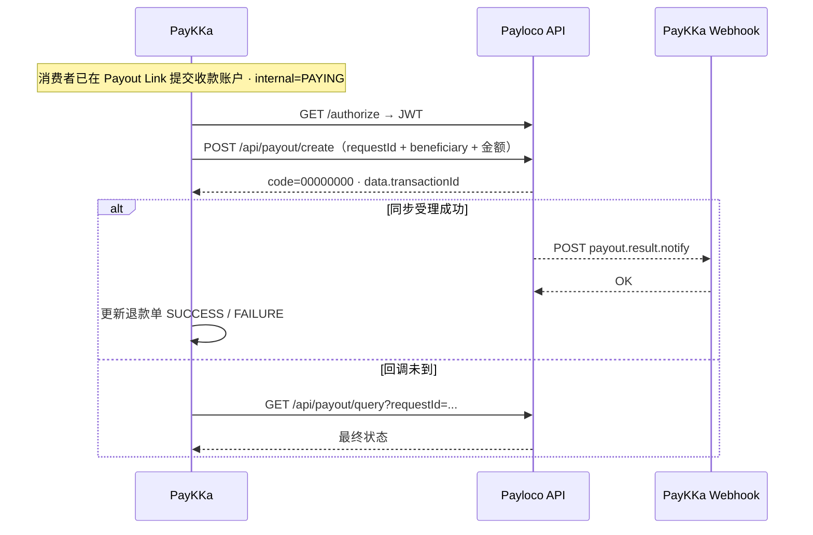

# Payloco Payout 代付对接说明

**适用场景**：PayKKa 代付退款 · **AUTO 自动打款**（消费者已在 Payout Link 填好收款账户后，由 Payloco 出款）

**官方产品页**：[Payloco Disbursement（全球付款）](https://www.payloco.com/disbursement.php)

---

## 1. 官方文档入口

| 文档 | 链接 | 用途 |
|------|------|------|
| 文档首页 | https://docs.payloco.com/ | 总入口 |
| 中文文档 | https://docs.payloco.com/zh/ | 中文指南 |
| **OpenAPI 交互文档** | https://docs.payloco.com/api.html | **Payout 请求/响应字段以这里为准** |
| 接入与签名（中文） | https://docs.payloco.com/zh/guide/ConfigSettings | 环境、鉴权、签名、接口列表 |
| 接入与签名（英文） | https://docs.payloco.com/guide/ConfigSettings | 同上 |
| 接入流程（中文） | https://docs.payloco.com/zh/guide/IntegrationProcess | 开户、UAT、联调、上生产 |
| 支付方式 & 能力简码 | https://docs.payloco.com/zh/guide/methodList | 收单 `capabilityCode`；代付见 §5.1 `accountInfo` |
| 资金管理 | https://www.payloco.com/funds.php | 余额、结算说明 |

> 字段级定义请在 [api.html](https://docs.payloco.com/api.html) 搜索 **Payout** 分组下的 `create` / `query` / `notify`。

---

## 2. 环境与网关

| 环境 | Base URL | 说明 |
|------|----------|------|
| **UAT** | `https://uat-api.payloco.com` | 联调测试 |
| **生产** | `https://api.payloco.com` | 正式业务 |

- UAT / 生产的 `X-AccessCode`、`X-SecretKey`、RSA 密钥**互相独立**，不可混用。
- 密钥在 Payloco **商户后台 → 个人中心 → 密钥查看** 获取（见[接入流程](https://docs.payloco.com/zh/guide/IntegrationProcess)）。

---

## 3. Payout 相关 API 一览

来源：[接入与签名 · 接口列表](https://docs.payloco.com/zh/guide/ConfigSettings)

| 产品 | 接口 | 方法 & 路径 | 说明 |
|------|------|-------------|------|
| 认证 | 获取 Token | `GET /authorize` | Header 传 AccessCode + SecretKey 换 JWT；**不加签** |
| **代付** | **发起代付** | `POST /api/payout/create` | 向用户打款（核心） |
| **代付** | **代付查询** | `GET /api/payout/query?requestId=&transactionId=` | 主动查状态 |
| **代付** | **代付回调** | Webhook `payout.result.notify` | 异步结果通知 |
| 余额 | 账户查询 | `GET /api/balance/list?currency=` | 打款前查余额（建议） |

---

> 字段级定义来源：Payloco OpenAPI — https://uat-api.payloco.com/api-docs（[api.html](https://docs.payloco.com/api.html) 同源）

---

## 4. 鉴权 & 签名

### 4.1 获取 Token `GET /authorize`

```http
GET https://uat-api.payloco.com/authorize
X-AccessCode: {your_access_code}
X-SecretKey: {your_secret_key}
```

**响应 `data`（TokenInfo）**

| 字段 | 类型 | 说明 |
|------|------|------|
| `token` | string | JWT，后续放 `Authorization: Bearer {token}` |
| `expireIn` | integer | 有效期（秒），过期需重新获取 |

---

### 4.2 业务请求 Header（含 payout/create）

| Header | 必填 | 说明 |
|--------|------|------|
| `Authorization` | ✅ | `Bearer {token}` |
| `X-AccessCode` | ✅ | 接入码 |
| `X-Signature` | ✅（POST） | 对 **request.body** 做 RSA 签名 |
| `Content-Type` | ✅ | `application/json` |

**签名算法**：`SHA256withRSA`，RSA 2048，私钥 PKCS#8，签名结果 Base64。

详见：[接入与签名 · 请求签名](https://docs.payloco.com/zh/guide/ConfigSettings)

### 4.3 Webhook 验签

- Payloco → 商户：`POST` + JSON body
- 用 **Payloco 平台公钥**验签（收到 raw body 后立刻验，不要先改 body）
- 商户处理成功后 **返回字符串 `OK`**
- 事件名：**`payout.result.notify`**

## 5. 请求 / 响应字段明细

> 以下字段摘自 Payloco OpenAPI（`ApiPayoutCreateRequest` 等）。**代付不走收单的 `capabilityCode`**，而是通过 `beneficiary.accountInfo` 指定账户类型（Bank / Wallet）、钱包品牌、银行信息等。

### 5.1 发起代付 `POST /api/payout/create`

#### 5.1.1 请求体顶层字段

| 字段 | 必填 | 类型 | 说明 | PayKKa 映射建议 |
|------|:----:|------|------|----------------|
| `requestId` | ✅ | string | 商户侧唯一请求号（幂等） | 代付流水号 / 退款单号 |
| `debitCur` | ✅ | string | 扣款币种（商户账户扣款币种） | 与本币一致时 = `remitCur` |
| `debitAmt` | — | int64 | 扣款金额，**最小单位 ×100** | 与 `remitAmt` 同币时可只填一侧 |
| `remitCur` | ✅ | string | 到账币种 | 原订单币种，如 `THB` / `IDR` |
| `remitAmt` | — | int64 | 到账金额，**最小单位 ×100** | 退款金额，如 1500.00 THB → `150000` |
| `fxQuoteId` | — | string | 换汇报价 ID | 跨币种代付时使用 |
| `beneficiary` | ✅ | object | 收款人信息，见 §5.1.2 | 来自 Payout Link 消费者填写 |
| `remittanceInfo` | — | string | 附言 / 备注 | 可填退款单号 |
| `chargeBearer` | — | string | SWIFT 费用承担方，如 `SHA` | 跨境场景 |
| `callbackUrl` | ✅ | string | 代付结果异步通知 URL | PayKKa 渠道回调地址 |

**金额规则**（与收单一致）：金额传**分**，`100.00` → `10000`。代付退款本币场景通常 `debitCur = remitCur`，`debitAmt = remitAmt`。

#### 5.1.2 `beneficiary` 收款人对象

**方式 A：传 `beneficiaryId`**（Payloco 已保存的收款人）

| 字段 | 必填 | 类型 | 说明 |
|------|:----:|------|------|
| `beneficiaryId` | ✅ | int64 | Payloco 分配的收款人 ID |
| `details` | — | object | 有 ID 时可不传 |

**方式 B：传 `details`**（代付退款常用 — 消费者每次填新账户）

| 字段 | 必填 | 类型 | 说明 |
|------|:----:|------|------|
| `beneficiaryId` | — | int64 | 可选 |
| `details` | ✅ | object | 收款人明细，见下表 |

**`beneficiary.details` 字段**

| 字段 | 必填 | 类型 | 说明 |
|------|:----:|------|------|
| `beneficiaryType` | ✅ | string | `Personal` / `Business` |
| `beneficiaryName` | ✅ | string | 收款人姓名 |
| `beneficiaryNickname` | — | string | 昵称 |
| `firstName` | — | string | 名 |
| `lastName` | — | string | 姓 |
| `beneficiaryCountryCode` | — | string | 收款人所在国家/地区，如 `TH` |
| `beneficiaryAddress` | — | string | 地址 |
| `postalCode` | — | string | 邮编 |
| `contactPhone` | — | string | 联系电话 |
| `contactEmail` | — | string | 联系邮箱 |
| `idType` | — | string | 证件类型 |
| `idNumber` | — | string | 证件号 |
| `gender` | — | string | 性别 |
| `dob` | — | datetime | 出生日期 |
| `accountInfo` | ✅ | object | **账户信息（核心）**，见 §5.1.3 |
| `favorite` | — | int | 是否收藏收款人：`1` 是 / `0` 否 |

#### 5.1.3 `beneficiary.details.accountInfo` 账户信息

| 字段 | 必填 | 类型 | 说明 |
|------|:----:|------|------|
| `accountType` | ✅ | string | `Bank` 银行账户 / `Wallet` 电子钱包 |
| `accountName` | ✅ | string | 账户名（Wallet 场景可能可省略，以联调为准） |
| `accountNumber` | ✅ | string | 账号 / 钱包号 / PromptPay 号 |
| `accountCurrency` | ✅ | string | 账户币种，如 `THB` |
| `walletBrand` | ✅* | string | `accountType=Wallet` 时必填，见下表 |
| `bankInfo` | ✅* | object | `accountType=Bank` 时必填，见 §5.1.4 |

**`walletBrand` 枚举（OpenAPI）**

`GCash` · `PayMaya` · `Maya` · `GrabPay` · `GrapPay` · `Alfa` · `Konnect` · `UBank` · `NayaPay` · `SadaPay` · `Bykea` · `Finja` · `EasyPaisa` · `JazzCash`

> PromptPay / QRIS 等具体走 `Bank` 还是 `Wallet`、`walletBrand` / `bankCode` 取何值，需与 Payloco 商务或联调群确认（[支付方式列表](https://docs.payloco.com/zh/guide/methodList) 中的能力简码主要用于**收单**，代付以 `accountInfo` 为准）。

#### 5.1.4 `accountInfo.bankInfo` 银行信息（`accountType=Bank`）

| 字段 | 必填 | 类型 | 说明 |
|------|:----:|------|------|
| `bankCode` | — | string | Payloco 银行编码，如 `PHFPCBC` |
| `bankName` | ✅ | string | 银行名称 |
| `bankBranch` | — | string | 支行 |
| `bankCountryCode` | ✅ | string | 银行所在国家/地区 |
| `bankAddress` | — | string | 银行地址 |
| `clearingSysType` | ✅ | string | 清算系统，如 `SWIFT` / 本地清算码 |
| `clearingSysNumber` | ✅ | string | 清算号（SWIFT Code / Routing / Sort Code 等） |

#### 5.1.5 请求示例

**钱包代付（如 GCash 退款，菲律宾）**

```json
{
  "requestId": "RG211005336771096419",
  "debitCur": "PHP",
  "remitCur": "PHP",
  "remitAmt": 150000,
  "callbackUrl": "https://callback.paykka.com/payloco/payout",
  "remittanceInfo": "Payout refund RG211005336771096419",
  "beneficiary": {
    "details": {
      "beneficiaryType": "Personal",
      "beneficiaryName": "Juan Dela Cruz",
      "beneficiaryCountryCode": "PH",
      "contactPhone": "639123456789",
      "accountInfo": {
        "accountType": "Wallet",
        "accountName": "Juan Dela Cruz",
        "accountNumber": "09123456789",
        "accountCurrency": "PHP",
        "walletBrand": "GCash",
        "bankInfo": {
          "bankName": "N/A",
          "bankCountryCode": "PH",
          "clearingSysType": "LOCAL",
          "clearingSysNumber": "N/A"
        }
      }
    }
  }
}
```

**银行代付（本币，结构示例）**

```json
{
  "requestId": "RG211005336771096420",
  "debitCur": "THB",
  "remitCur": "THB",
  "remitAmt": 150000,
  "callbackUrl": "https://callback.paykka.com/payloco/payout",
  "beneficiary": {
    "details": {
      "beneficiaryType": "Personal",
      "beneficiaryName": "Somchai",
      "beneficiaryCountryCode": "TH",
      "accountInfo": {
        "accountType": "Bank",
        "accountName": "Somchai",
        "accountNumber": "1234567890",
        "accountCurrency": "THB",
        "walletBrand": "N/A",
        "bankInfo": {
          "bankCode": "{Payloco银行码}",
          "bankName": "Kasikorn Bank",
          "bankCountryCode": "TH",
          "clearingSysType": "LOCAL",
          "clearingSysNumber": "{本地清算号}"
        }
      }
    }
  }
}
```

> `bankInfo` / `walletBrand` 占位值需联调时由 Payloco 提供；上例仅展示 JSON 结构。

#### 5.1.6 同步响应 `POST /api/payout/create`

**外层**

| 字段 | 类型 | 说明 |
|------|------|------|
| `code` | string | `00000000` = 成功 |
| `msg` | string | 描述 |
| `data` | object | 见下 |

**`data`（ApiPayoutCreateVo）**

| 字段 | 类型 | 说明 |
|------|------|------|
| `requestId` | string | 回显商户请求号 |
| `requestTime` | string | 服务端收到请求时间，`yyyy-MM-dd'T'HH:mm:ssXXX` |
| `transactionId` | int64 | **Payloco 代付单号**，建议落库为渠道代付订单号 |

---

### 5.2 代付查询 `GET /api/payout/query`

#### Query 参数

| 参数 | 必填 | 类型 | 说明 |
|------|:----:|------|------|
| `requestId` | 二选一 | string | 商户请求号 |
| `transactionId` | 二选一 | int64 | Payloco 代付单号 |

#### 响应 `data`（ApiPayoutListVo）主要字段

| 字段 | 类型 | 说明 |
|------|------|------|
| `requestId` | string | 商户请求号 |
| `transactionId` | int64 | Payloco 代付单号 |
| `status` | string | 交易状态，如 `Processing` / `Success` / `Failed`（以实际枚举为准） |
| `message` | string | 失败原因 |
| `requestTime` | string | 请求时间 |
| `finishTime` | string | 终态时间 |
| `debitCur` / `debitAmt` | string / int64 | 扣款币种 / 金额 |
| `remitCur` / `remitAmt` | string / int64 | 到账币种 / 金额 |
| `feeAmt` / `feeCur` | int64 / string | 手续费 |
| `fxRate` / `fxCurPair` | int64 / string | 汇率（跨币种时） |
| `beneficiary` | object | 收款人回显（ApiPayoutBeneVo） |

---

### 5.3 代付回调 Webhook `payout.result.notify`

Payloco → 商户 `POST`，验签后处理；响应 body 返回 **`OK`**。

**通知体（WebhookEventPayoutResultNotifyVo）**

| 字段 | 类型 | 说明 |
|------|------|------|
| `eventId` | string | 事件 ID |
| `eventName` | string | `payout.result.notify` |
| `data` | object | 见下 |

**`data`（PayoutResultNotifyVo）**

| 字段 | 类型 | 说明 |
|------|------|------|
| `requestId` | string | 商户请求号 |
| `transactionId` | int64 | Payloco 代付单号 |
| `status` | string | 终态 / 处理中状态 |
| `message` | string | 失败原因 |
| `requestTime` | datetime | 请求时间 |
| `finishTime` | datetime | 完成时间 |

---

### 5.4 余额查询 `GET /api/balance/list`

Query 参数 `balanceApiReq`（对象，具体字段见 OpenAPI `BalanceApiReq`）。打款前建议查对应币种余额。

---

## 6. 核心接口说明（摘要）

### 6.1 发起代付

见 **§5.1** 完整字段表与 JSON 示例。

### 6.2 代付查询

见 **§5.2**。

### 6.3 代付回调

| 项 | 值 |
|----|-----|
| 事件 | `payout.result.notify` |
| 方法 | `POST` |
| 响应 | 返回 `OK` |

**PayKKa 侧建议**：

1. 验签 → 幂等更新代付状态
2. 成功 → 退款单 `SUCCESS`，写 `transactionId`
3. 失败 → 退款单 `FAILURE`（方案 A 直接终态）
4. 与 `GET /api/payout/query` 互为兜底

### 6.4 余额查询

见 **§5.4**。

---

## 7. 对接时序（PayKKa 代付退款 · AUTO）



---

## 8. 与 PayKKa 代付退款的映射

| PayKKa 概念 | Payloco 侧 |
|-------------|------------|
| 退款单进入 `PAYING` + `payoutMode=AUTO` | 调 `payout/create` |
| 渠道代付订单号 | `transactionId` |
| 商户幂等键 | `requestId` |
| 消费者姓名 | `beneficiary.details.beneficiaryName` |
| 钱包号 / 银行账号 | `beneficiary.details.accountInfo.accountNumber` |
| 账户类型 | `accountInfo.accountType` = `Bank` / `Wallet` |
| 钱包品牌 | `accountInfo.walletBrand` |
| 打款成功 | `payout.result.notify` 成功 → 对外 `SUCCESS` |
| 打款失败 | 回调失败或查询失败 → 对外 `FAILURE` |
| **不支持自动代付** | **不走 Payloco API**，走人工 |

---

## 9. 联调 Checklist

- [ ] UAT 密钥、RSA 公私钥已在商户后台配置
- [ ] `GET /authorize` 能拿到 token
- [ ] `payout/create` 签名通过、`remitAmt` 金额 ×100
- [ ] `beneficiary.accountInfo` 字段与目标国家/支付方式联调通过
- [ ] `callbackUrl` 可收到 `payout.result.notify` 且返回 `OK`
- [ ] `payout/query` 补单链路通
- [ ] 余额不足、账号错误等失败场景有日志
- [ ] UAT 通过后联系 Payloco 开生产环境

---

## 10. 注意事项

1. **代付能力需单独开通**：收单支持 PromptPay 不代表代付 API 已开，需商务确认。
2. **代付不用 `capabilityCode`**：收单用能力简码；代付用 `beneficiary.accountInfo`（Bank / Wallet）。
3. **金额单位**：`remitAmt` / `debitAmt` 传分（×100）。
4. **幂等**：同一笔退款勿重复 `create`，`requestId` 保持唯一。
5. **与收单区别**：收单 `/api/payment/create` + `acquire.payment.result`；代付 `/api/payout/create` + `payout.result.notify`。

---

## 11. 参考链接速查

```
OpenAPI JSON https://uat-api.payloco.com/api-docs
文档首页     https://docs.payloco.com/
API 文档     https://docs.payloco.com/api.html
接入签名     https://docs.payloco.com/zh/guide/ConfigSettings
接入流程     https://docs.payloco.com/zh/guide/IntegrationProcess
支付方式表   https://docs.payloco.com/zh/guide/methodList
代付产品页   https://www.payloco.com/disbursement.php
UAT 网关     https://uat-api.payloco.com
生产网关     https://api.payloco.com
```
