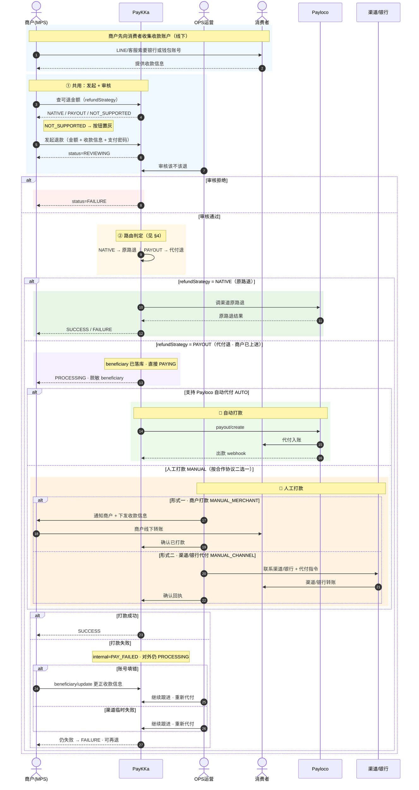
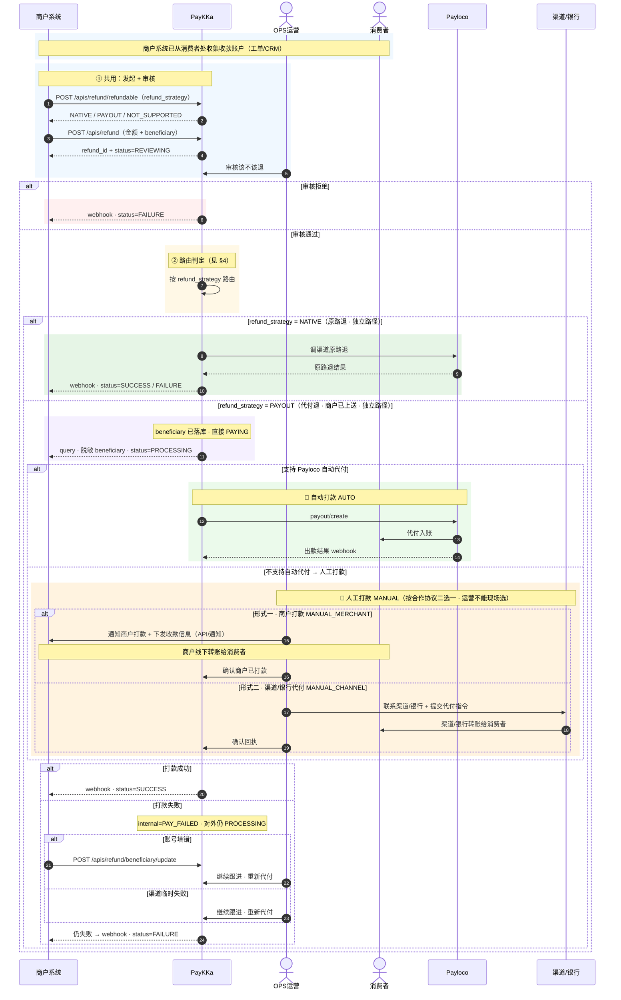
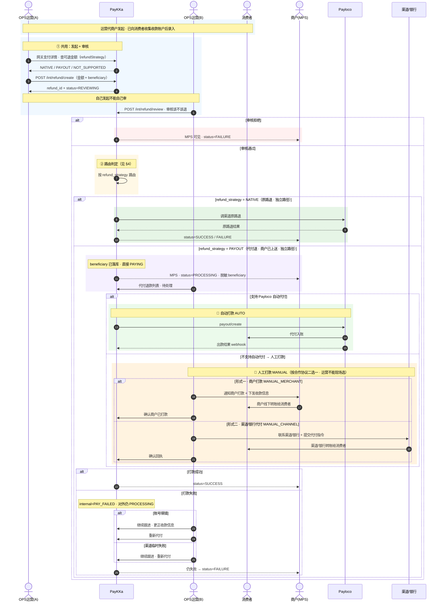

# 东南亚本地支付 — 代付退款需求（商户收集方案）

## 1. 背景

QRIS、PromptPay、PayNow、DuitNow、VietQR 这些走 Payloco 收单的东南亚本地支付退不回原路，PayKKa 现在干脆藏起退款按钮，商户遇客诉没法退。

本需求做「代付退款」：钱不原路退，改打到消费者的收款账户。核心是商户向消费者问清收款账户后，在发起退款时一并上送（竞品 PingPong、连连同类思路）。

**整体一条线**：

```
商户向消费者收集收款账户
  → 发起退款（金额 + 收款信息）→ 运营先审核该不该退
  → 通过 → 直接打款（支持的自动打，不支持的人工打）
  → 成功 SUCCESS ｜ 失败 FAILURE（打款失败等，商户可更正账户后再退）
```

---

## 2. 功能描述（MPS / API / OPS）

发起、审核两步跟现在的退款一样（填金额 + 收款信息、审「该不该退」）。审核通过后先路由判定 refundStrategy，再分岔到原路退 / 代付退；代付退不再发链接，收款账户已在发起时上送。

### 2.1 场景故事说明

**场景：曼谷商户小王，PromptPay 退款 1,500 THB**

**人物**

- **小王**：曼谷一家跨境电商商户，用 MPS 后台管订单
- **阿明**：在泰国用 PromptPay 付了 1,500 THB 买耳机，收到货后申请退货退款
- **小李**：PayKKa OPS 运营，负责审核、代付
- **支付方式**：PromptPay（走 Payloco 收单，不能原路退回）

**① 发起 + 审核（共用段）**

阿明联系小王要退款。小王通过 LINE 向阿明要了 PromptPay 绑定银行账号和姓名，打开 MPS 交易详情，点「退款」。

系统先查可退金额，退款按钮可用。小王填 1,500 THB、退款原因，并在弹窗里填写阿明的收款信息（姓名 + 银行账号），再输入支付密码提交。退款单 RG21100xxxx，状态 审核中（REVIEWING）。

次日小李在 OPS 退款审核里看到这笔单：金额合理、无重复退款、收款信息完整，点通过。

**② 路由：代付退（不是原路退）**

审核通过后，系统判定走 PAYOUT 代付退。收款信息已在发起时上送，跳过发链接，直接进入打款环节。

**③ 打款：三种可能（故事分叉）**

**路径 A · 自动打款（AUTO）**

若该商户 + PromptPay 支持自动代付：PayKKa 调 payout/create，钱由 Payloco 打到阿明账户。几分钟后 webhook 回来，状态 SUCCESS。阿明收到退款，客诉结束。

**路径 B · 人工 · 商户打款**

若 PromptPay 不能自动代付，且 PayKKa 与该商户的协议约定：退款由商户自行打出。

小李在 OPS 代付退款列表看到单子「打款中」，查看完整收款信息后通知小王：「请按信息线下转 1,500 THB 给阿明。」小王转完后小李在 OPS 点确认商户已打款，状态 SUCCESS。

**路径 C · 人工 · 渠道/银行代付**

同样是 PromptPay 不能自动代付，但 PayKKa 与合作银行签的是：由银行代付。

小李在 OPS 代付退款列表看到单子「打款中」。小李联系银行：银行把 1,500 THB 打到阿明账户，回执给小李。小李在 OPS 确认回执，状态 SUCCESS。

### 2.2 MPS 流程

代付退时，MPS 退款弹窗须填金额 + 原因 + 收款信息 + 支付密码。退款详情展示脱敏收款信息。



### 2.3 API 流程

商户系统调 POST /apis/refund 发起，**必填 beneficiary**（商户已从消费者处收集）；审核通过后 PayKKa 直接打款，终态 webhook 通知。



### 2.4 OPS 流程

🖥 UI：https://uii-wheat.vercel.app/payout-refund-list



---

## 3. 退款状态

两套：退款 4 态（保持原样）；内部 5 态（仅 OPS 菜单可见）。

### 3.1 退款状态（保持原样）— 4 个

| status | 商户看到 | 什么时候 |
|--------|----------|----------|
| REVIEWING | 审核中 | 发起后等审核 |
| PROCESSING | 处理中 | 审核通过 → 成功/失败之前 |
| SUCCESS | 退款成功 | 打款完成 |
| FAILURE | 退款失败 | 审核拒绝、运营放弃、打款失败 |

### 3.2 内部状态 — 5 个

| internal_status | OPS 看到 | 什么时候 | 对外映射 |
|-----------------|----------|----------|----------|
| REVIEWING | 待审核 | 发起后 | REVIEWING |
| PAYING | 打款中 | 代付退审核通过（beneficiary 已上送）；或原路退审核通过 | PROCESSING |
| PAY_FAILED | 打款失败待处理 | 渠道/账号等原因打款失败 | PROCESSING |
| SUCCESS | 退款成功 | 钱打出去了 | SUCCESS |
| FAILURE | 退款失败 | 审核拒绝 / 放弃 / 终态打款失败 | FAILURE |

PAYING / PAY_FAILED 对外一律 PROCESSING。

---

## 4. 路由（退款方式判定）

退款方式不用商户选，系统自己判断。

### 4.1 三种退款方式

| # | 退款方式 | 什么时候走 | 收款账户谁提供 | 谁打款 |
|---|----------|------------|----------------|--------|
| ① | 原路退（老功能） | 支持原路退的 | 不用填 | 原路退回 |
| ② | 代付退（商户收集） | 退不回原路，但可代付 | 发起时商户上送 | 自动 or 人工 |
| ③ | 不可退 | 上面都不满足 | — | 按钮置灰 |

---

## 5. MPS 功能细节

代付退时，MPS 退款弹窗在金额、原因之外，须增加收款信息区块（字段模板见 §8）。退款详情展示脱敏 beneficiary；账号错时可更正收款信息。

---

## 6. API 细节

### 6.1 API 改造

| 接口 | 改造点 |
|------|--------|
| POST /apis/refund | 代付退必填 beneficiary |
| POST /apis/refund/query | 代付退多返回脱敏 beneficiary |
| POST /apis/refund/beneficiary/update | 打款失败且账号错时，商户更正收款信息 |

---

## 7. OPS 细节

🖥 UI：https://uii-wheat.vercel.app/payout-refund-list

### 7.1 OPS 职责与操作按钮

| 环节 | 运营要做的 |
|------|------------|
| 发起 | 代商户发起（须填收款信息） |
| 审核 | 审该不该退 |
| 继续跟进 | 账号错 → 更正收款；渠道失败 → 重新代付 |
| 人工打款（成功 or 失败） | 联系商户，或者银行打款 |

---

## 8. 收款信息字段规范

商户在 MPS 弹窗或 Open API 发起时填写，字段由「收款字段模板」配置。

### 8.5 校验规则

| 项 | 规则 |
|----|------|
| 发起时校验 | beneficiary 不完整 → 创建失败，不进审核 |
| 存储 | 加密落库；MPS/API 脱敏，OPS 看全量须权限 + 审计 |
| 更正 | 打款失败且账号错 → beneficiary/update，可配置次数上限 |

---

## 9. Payloco 对接

https://jlpay.yuque.com/pmw77l/baps75/zqdcbztg70xda5t4
